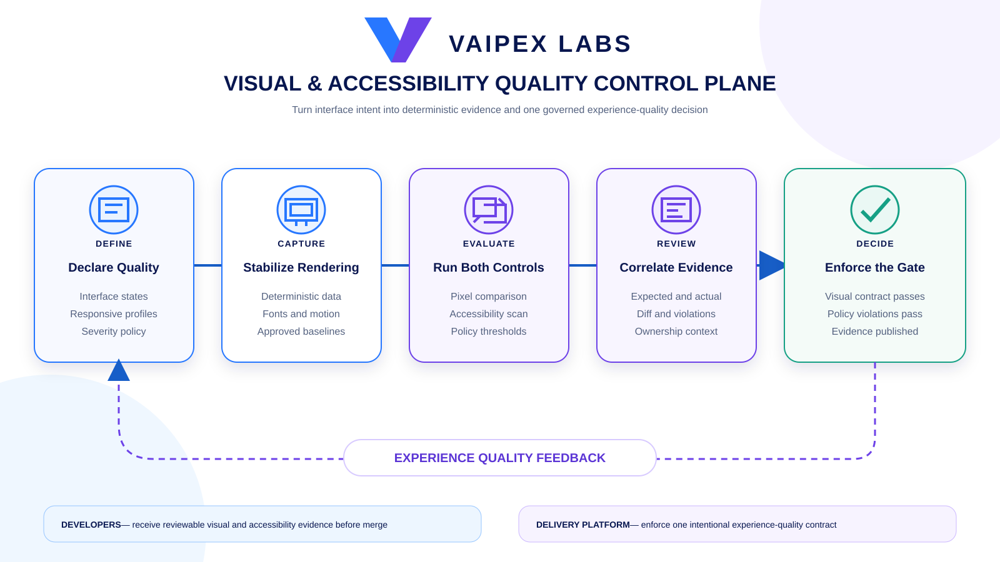
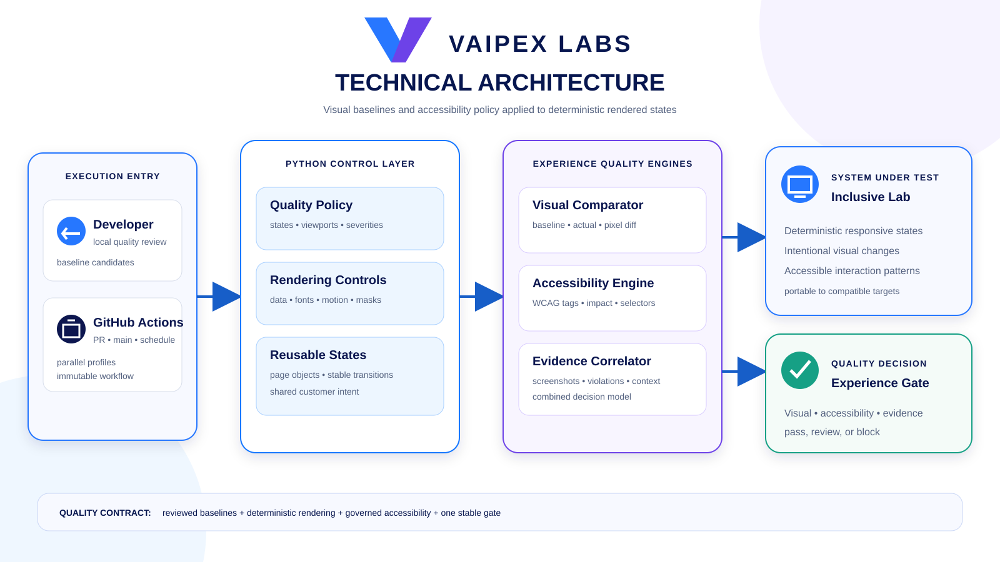

# Vaipex Visual & Accessibility Quality Control Plane

An open reference implementation for governing visual regression and
accessibility quality with Playwright and Python. It turns approved interface
intent into deterministic screenshots, policy-based accessibility evidence,
and one delivery decision.

Developed by **Vaipex Labs** for the developer and quality engineering
communities.


[Project Intent](#project-intent) ·
[Quality Contract](#quality-contract) ·
[Delivery Flow](#delivery-flow) ·
[Architecture](#architecture) ·
[Target Experience](#target-experience) ·
[Toolchain Setup](#toolchain-setup) ·
[Reference Application](#reference-application) ·
[Baseline Governance](#baseline-governance) ·
[Accessibility Policy](#accessibility-policy) ·
[Delivery Roadmap](#delivery-roadmap) ·
[Project Boundaries](#project-boundaries)

## Project Intent

A functional test can pass while an interface is visually broken or unusable
with assistive technology. Screenshot comparison without deterministic state
creates noise, while an ungoverned accessibility scanner can produce findings
without an actionable delivery decision.

This project demonstrates a combined quality capability that:

- Defines supported pages, states, and responsive viewports as policy.
- Captures deterministic screenshots against reviewed baselines.
- Controls animation, time, fonts, data, and dynamic visual regions.
- Scans rendered journeys against declared accessibility standards.
- Applies severity and exception policy consistently.
- Preserves expected, actual, diff, and violation evidence.
- Requires explicit review before a visual baseline changes.
- Produces one stable visual and accessibility gate for delivery automation.

## Quality Contract

The control plane will enforce six principles:

1. **Intentional coverage:** every visual state and accessibility journey has a
   documented customer or platform risk.
2. **Deterministic capture:** test data, viewport, browser, fonts, animation,
   and volatile regions are controlled before comparison.
3. **Reviewed baselines:** a changed screenshot is evidence to review, never a
   file to overwrite automatically.
4. **Policy-based accessibility:** standards, tags, severities, and exceptions
   are versioned with the code.
5. **Actionable evidence:** failures identify the affected state, rule,
   viewport, ownership, and supporting artifacts.
6. **One decision:** delivery consumes the combined quality gate rather than
   interpreting individual scans or screenshots.

## Delivery Flow

Interface intent moves through controlled capture, policy evaluation,
reviewable evidence, and one governed experience-quality decision.



## Architecture

Developers and GitHub Actions invoke the same Python control layer. Playwright
renders deterministic interface states, the visual comparator evaluates them
against reviewed baselines, the accessibility engine evaluates the rendered
DOM, and the evidence layer publishes one combined gate.



## Target Experience

The finished implementation will provide one short demonstration:

```bash
./scripts/two-minute-demo.sh
```

It will validate the locked toolchain, prove an approved visual state, expose
an intentional visual regression, detect a policy-blocking accessibility
violation, preserve both evidence sets, and print the combined quality
decision.

## Toolchain Setup

The project uses Python 3.12 and a fully resolved dependency lock. One command
creates the local virtual environment, installs the locked packages, installs
the Playwright-managed Chromium renderer, and validates the result:

```bash
./scripts/setup.sh
```

Activate the environment when using the Python tools directly:

```bash
source .venv/bin/activate
```

Validate an existing environment without changing it:

```bash
./scripts/validate-toolchain.sh
```

Chromium is the deliberate reference renderer for this project. Keeping one
browser engine and its version under Playwright's control makes screenshot
baselines reproducible across local and continuous execution. The preceding
lab in this series owns cross-browser compatibility coverage.

## Reference Application

The repository includes a polished, responsive experience-quality dashboard
designed specifically for deterministic visual and accessibility validation.
It uses fixed data, local assets, a system-font stack, explicit render identity,
reduced-motion handling, and no calls to external services.

Start it with:

```bash
./scripts/start-app.sh
```

Open [http://127.0.0.1:8000](http://127.0.0.1:8000). Stop the application with
`Control-C`. Set `PORT` when port 8000 is occupied:

```bash
PORT=8080 ./scripts/start-app.sh
```

The application exposes addressable states so automation can reproduce the
same interface without test-only DOM manipulation:

| State | URL | Intended evidence |
| --- | --- | --- |
| Ready | `/?state=ready` | Healthy populated dashboard |
| Empty | `/?state=empty` | First-use and empty-content behavior |
| Degraded | `/?state=degraded` | Blocking quality status and warning treatment |
| Review dialog | `/?dialog=true` | Form, focus, overlay, and responsive modal state |

The readiness contract is available at `/health/ready` for local orchestration.

## Baseline Governance

Visual baselines are product evidence, not disposable test output.

| Control | Intent |
| --- | --- |
| Named states | Capture meaningful pages, dialogs, empty states, and error states |
| Fixed profiles | Bind baselines to explicit browser and viewport contracts |
| Stable rendering | Disable animation, wait for fonts, and seed deterministic data |
| Volatile-region policy | Mask only reviewed dynamic content with a documented reason |
| Explicit update | Generate candidates through one supported command |
| Pull-request review | Review expected, actual, and diff images together |
| Protected main | Accept a new baseline only with the related product change |

Reviewed images will live under `tests/visual/baselines/`. Generated candidate
and diff evidence will remain outside Git under `artifacts/` and `reports/`.

### Governed baseline lifecycle

Generate a candidate set without changing the approved baseline boundary:

```bash
./scripts/propose-baselines.sh
```

Review every PNG and its manifest under `artifacts/visual/candidates/`. The
manifest records the policy digest, route, browser version, renderer,
dimensions, and screenshot SHA-256 digest used for the review. Candidate
evidence is intentionally ignored by Git.

Only after review, promote that exact candidate set with the explicit approval
signal:

```bash
VAIPEX_APPROVE_BASELINES=1 ./scripts/accept-baselines.sh
```

Promotion verifies every candidate's digest and dimensions, rejects unsafe
paths, copies the reviewed bytes into `tests/visual/baselines/`, and publishes
the approval manifest. It never generates a new screenshot while accepting.

Verify the committed approval boundary at any time:

```bash
./scripts/verify-baselines.sh
```

The approved matrix covers ready, empty, degraded, and review-dialog states at
desktop 1440 × 1000 and mobile 390 × 844 using the pinned Chromium renderer.

### Run the visual quality gate

```bash
./scripts/test-visual.sh
```

The command captures all eight profile-state combinations, compares them with
the approved images, and applies the versioned threshold policy. A channel
delta of eight or less is treated as rendering noise; the gate fails when more
than 0.1% of pixels exceed that delta or when dimensions change.

Review evidence is written outside Git:

| Evidence | Location |
| --- | --- |
| Current captures | `artifacts/visual/actual/` |
| Highlighted differences | `artifacts/visual/diffs/` |
| Machine-readable decision | `reports/visual/results.json` |

Diff images preserve the expected interface in muted grayscale and highlight
changed pixels in magenta. Dimension failures preserve expected and actual
images side by side, separated by a magenta boundary.

## Accessibility Policy

The accessibility gate will use automated analysis as an engineering control,
not as a claim of full accessibility certification.

| Policy dimension | Intended contract |
| --- | --- |
| Standard | WCAG 2.2 Level A and AA automation-supported rules |
| Scope | Customer-critical rendered states and interactive components |
| Blocking severity | Critical and serious violations |
| Advisory severity | Moderate and minor findings remain visible as evidence |
| Exceptions | Versioned, owned, justified, and time-bounded |
| Evidence | Rule, impact, help, selector, markup, and remediation guidance |

Automated scans complement keyboard, screen-reader, content, and human
usability review; they do not replace them.

## Quality Dimensions

| Dimension | Representative coverage |
| --- | --- |
| Visual state | Landing, populated, modal, validation, and completion states |
| Responsive viewport | Desktop, compact desktop, and touch-oriented mobile |
| Rendering contract | Stable browser, fonts, animation, color scheme, and data |
| Accessibility | Structure, names, roles, contrast, forms, focus, and landmarks |
| Evidence | Expected, actual, diff, scan report, HTML, and machine-readable JSON |
| Execution stage | Local review, pull request, `main`, and scheduled verification |

## Delivery Roadmap

- [x] Establish the repository, quality contract, licensing, and project shape.
- [x] Add the locked Python, Playwright, and accessibility-analysis toolchain.
- [x] Deliver a deterministic responsive reference application.
- [x] Implement reviewed visual baselines and explicit update controls.
- [x] Add desktop and mobile visual-regression profiles.
- [ ] Enforce WCAG tags, severity policy, and governed exceptions.
- [ ] Correlate visual and accessibility evidence into one decision.
- [ ] Enforce the combined quality gate through GitHub Actions.
- [ ] Publish the two-minute demo and operating guidance.

Each milestone is independently reviewable and preserves a usable project
state.

## Toolchain

| Tool | Role |
| --- | --- |
| Python 3.12 | Automation and policy orchestration language |
| Playwright 1.62.0 + Chromium | Pinned browser rendering, interaction, and screenshots |
| Pytest 9.1.1 | Fixtures, parametrization, markers, and assertions |
| axe-playwright-python 0.1.8 | Python adapter for automated axe-core evaluation |
| Pillow 12.3.0 | Deterministic image inspection and evidence metadata |
| FastAPI 0.141.1 | Self-contained responsive reference application |
| Ruff 0.16.3 | Python formatting and linting |
| GitHub Actions | Continuous combined quality-gate enforcement |

Direct dependencies are exactly pinned in `pyproject.toml`; the complete
transitive graph is committed in `requirements.lock`. `scripts/setup.sh`
rebuilds from that lock so contributors and automation execute the same
quality-toolchain contract.

## Repository Structure

```text
docs/images/              Vaipex delivery-flow and architecture illustrations
policies/                 Versioned visual and accessibility decision rules
src/                      Python control plane and reference application
src/.../static/           Local JavaScript and responsive visual system
src/.../templates/        Deterministic application markup and states
tests/accessibility/      Accessibility journeys and policy assertions
tests/visual/             Visual states, profiles, and reviewed baselines
scripts/                  Supported setup, execution, and demonstration commands
pyproject.toml            Package metadata and tool configuration
requirements.lock         Fully resolved Python dependency graph
```

## Project Boundaries

This project demonstrates automated visual-regression and accessibility
governance. It is not a substitute for usability research, manual keyboard and
screen-reader testing, disability-led review, accessibility certification, or
a commercial cross-device visual-testing service. It provides a repeatable
engineering signal that makes those broader practices easier to operate.

## Contributing

Community contributions are welcome. Keep baselines intentional, rendering
deterministic, accessibility policy explicit, exceptions owned, and evidence
actionable.

Licensed under the [Apache License 2.0](LICENSE).
