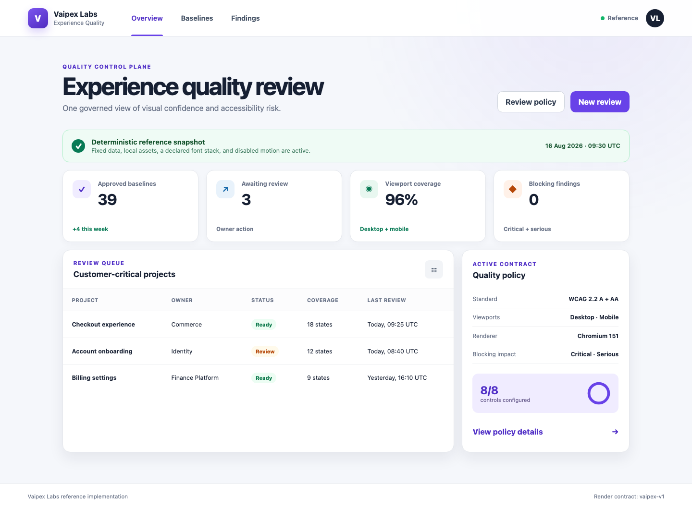

# Vaipex Visual & Accessibility Quality Control Plane

An open reference implementation for governing visual regression and
accessibility quality with Playwright and Python. It converts reviewed user
interface intent into deterministic evidence and one automated delivery
decision.

Developed by **Vaipex Labs** for the developer and quality engineering
communities.


[Two-Minute Demo](#two-minute-demo) ·
[What It Proves](#what-it-proves) ·
[Delivery Flow](#delivery-flow) ·
[Architecture](#architecture) ·
[Reference Experience](#reference-experience) ·
[Quality Controls](#quality-controls) ·
[Evidence](#evidence) ·
[Continuous Enforcement](#continuous-enforcement) ·
[Customization](#customization)

## Two-Minute Demo

Set up the locked Python 3.12, Playwright, Chromium, and axe-core toolchain:

```bash
./scripts/setup.sh
```

Run the complete control plane:

```bash
./scripts/two-minute-demo.sh
```

The demo validates the toolchain, verifies the reviewed baseline approval
boundary, runs the policy unit tests, captures eight responsive interface
states, evaluates WCAG-supported rules, and publishes one decision to
`reports/quality-gate.json`.

Expected conclusion:

```text
Accessibility  PASSED
Visual         PASSED
Combined quality decision: PROMOTE
```

## What It Proves

- Visual baselines are reviewed product evidence, not automatically overwritten
  test output.
- Desktop and mobile states are rendered from fixed routes, data, viewport,
  locale, timezone, color scheme, animation, and browser contracts.
- Pixel drift and dimension changes produce reviewable actual and diff images.
- WCAG 2.2 A and AA automation-supported rules are applied to the rendered DOM.
- Critical and serious accessibility findings block delivery; moderate and
  minor findings remain visible as advisory evidence.
- Accessibility exceptions must be narrowly scoped, owned, justified, and
  unexpired.
- Visual and accessibility signals remain independently reviewable while
  producing one stable `PROMOTE` or `REJECT` decision.
- Local execution and GitHub Actions use the same commands and locked toolchain.

## Delivery Flow

Interface intent moves through deterministic rendering, two policy-controlled
quality evaluations, reviewable evidence, and one governed delivery decision.


## Architecture

Developers and GitHub Actions invoke the same Python control layer. Playwright
renders the declared interface matrix, Pillow performs pixel comparison,
axe-core evaluates the rendered DOM, and the decision layer correlates both
evidence sets.


## Reference Experience

The repository includes a responsive experience-quality dashboard built for
repeatable visual and accessibility validation.



Start it locally:

```bash
./scripts/start-app.sh
```

Open [http://127.0.0.1:8000](http://127.0.0.1:8000) and stop it with
`Control-C`. Use another port when required:

```bash
PORT=8080 ./scripts/start-app.sh
```

| State | URL | Risk represented |
| --- | --- | --- |
| Ready | `/?state=ready` | Healthy populated dashboard |
| Empty | `/?state=empty` | First-use and empty-content behavior |
| Degraded | `/?state=degraded` | Blocking status and warning treatment |
| Review dialog | `/?dialog=true` | Form, focus, overlay, and modal behavior |

Every state is evaluated at desktop 1440 × 1000 and mobile 390 × 844. The
readiness contract is available at `/health/ready`.

## Quality Controls

### Governed visual baselines

Generate a candidate set without changing approved images:

```bash
./scripts/propose-baselines.sh
```

Review all candidate PNGs and `artifacts/visual/candidates/manifest.json`. The
manifest binds every image to its route, dimensions, browser, renderer, policy
digest, and SHA-256 digest.

Promote the exact reviewed bytes only after explicit approval:

```bash
VAIPEX_APPROVE_BASELINES=1 ./scripts/accept-baselines.sh
```

Verify the committed approval boundary or run the visual gate directly:

```bash
./scripts/verify-baselines.sh
./scripts/test-visual.sh
```

The comparator ignores channel deltas of eight or less and rejects a capture
when more than 0.1% of pixels exceed that tolerance. It also rejects dimension,
route, browser, renderer, policy, or capture-matrix drift.

### Policy-based accessibility

Run the accessibility gate independently:

```bash
./scripts/test-accessibility.sh
```

The versioned policy in `policies/accessibility.json` declares the WCAG tags,
responsive matrix, and impact classifications. The exception register in
`policies/accessibility-exceptions.json` starts empty. Any future exception
must define one rule, selector, profile/state, owner, reason, and expiry date;
broad, duplicate, incomplete, or expired entries fail policy validation.

Automated accessibility scans are an engineering control, not accessibility
certification. They complement manual keyboard, screen-reader, content, and
disability-led usability review.

### One delivery decision

Run both dimensions and correlate their evidence:

```bash
./scripts/test-quality.sh
```

The decision is `PROMOTE` only when the visual gate and blocking accessibility
gate both pass. Advisory and excepted findings remain visible without weakening
the decision contract.

## Evidence

Generated evidence stays outside version control while remaining available to
engineers and CI reviewers.

| Evidence | Location |
| --- | --- |
| Current captures | `artifacts/visual/actual/` |
| Pixel-difference images | `artifacts/visual/diffs/` |
| Visual decision | `reports/visual/results.json` |
| Raw axe results by state | `reports/accessibility/states/` |
| Accessibility decision | `reports/accessibility/results.json` |
| Combined decision | `reports/quality-gate.json` |

Diff images retain the expected interface in muted grayscale and highlight
changed pixels in magenta. Dimension mismatches preserve expected and actual
images side by side.

## Continuous Enforcement

`.github/workflows/quality-gate.yml` runs for pull requests, pushes to `main`,
and manual dispatches. It installs the locked toolchain, runs static and unit
checks, evaluates the combined gate, and uploads visual and accessibility
evidence even when a check fails. The evidence artifact is retained for 14
days.

Protect `main` and require the **Experience quality gate** check to prevent
unreviewed regressions from merging.

## Toolchain

| Tool | Role |
| --- | --- |
| Python 3.12 | Policy orchestration and decision logic |
| Playwright 1.62.0 + Chromium | Deterministic browser rendering and capture |
| Pillow 12.3.0 | Pixel comparison and diff evidence |
| axe-playwright-python 0.1.8 | Automated axe-core evaluation |
| Pytest 9.1.1 | Policy and control-plane verification |
| FastAPI 0.141.1 | Self-contained reference experience |
| Ruff 0.16.3 | Python static quality checks |
| GitHub Actions | Continuous quality-gate enforcement |

Direct dependencies are pinned in `pyproject.toml`; the fully resolved
transitive graph is committed in `requirements.lock`.

## Repository Structure

```text
.github/workflows/         Continuous quality-gate enforcement
docs/images/               Vaipex flow and architecture illustrations
policies/                  Visual, accessibility, and exception contracts
scripts/                   Supported setup, execution, and demo commands
src/                       Control plane and reference application
tests/unit/                Policy and decision tests
tests/visual/baselines/    Reviewed desktop and mobile evidence
```

## Customization

- Add a page or state to both policy matrices and approve the resulting visual
  candidates.
- Add a responsive profile with explicit width and height contracts.
- Adjust pixel tolerance only through a reviewed policy and baseline change.
- Change blocking impacts or WCAG tags in the accessibility policy.
- Add a temporary exception only with a narrow selector, owner, rationale, and
  expiration date.
- Replace the reference application with a deployed environment while keeping
  the same evidence and decision interfaces.

## Project Boundaries

This project demonstrates automated visual-regression and accessibility
governance. It is not a substitute for usability research, assistive-technology
testing, disability-led review, accessibility certification, or a commercial
cross-device testing service.

## Contributing

Community contributions are welcome. Keep baselines intentional, rendering
deterministic, accessibility policy explicit, exceptions owned, and evidence
actionable.

Licensed under the [Apache License 2.0](LICENSE).
